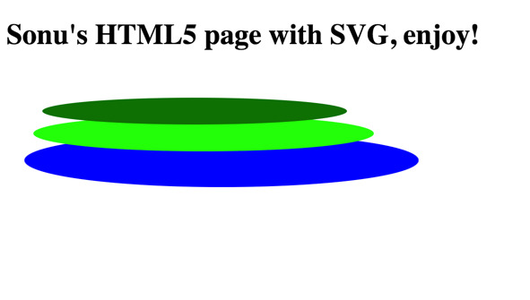

# HTML5 & CSS Tutorial

> This is a great online resource regarding HTML5 & CSS, they do a great job: 
__________________________________________________________________________________________________________________________________________

[HTML5 Resource](https://www.w3schools.com/html/html5_intro.asp)

I want to display some of my own work so you can understand how easy it is to build your own page, they are simple HTML5 pages and I will post the code below each image for review:

My portfolio is a little more complicated than just a simple HTML5 page, it includes some server side code such as Javascript to implement a few functions.

[My portfolio](https://sonuchavakula.github.io/)

Quick Look: 

Here is another page, which is a simple HTML5 page I created for a class project. I will post the code for this page below: 

