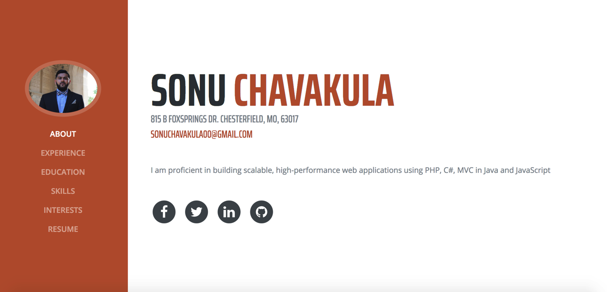

# HTML5 & CSS Tutorial

> This is a great online resource regarding HTML5 & CSS, they do a great job: 
___________________________
[HTML5 Resource](https://www.w3schools.com/html/html5_intro.asp)

___________________________

I want to display some of my own work so you can understand how easy it is to build your own page, these are some simple HTML5 pages and I will post the code below each image for review:
___________________________
My portfolio is a little more complicated than just a simple HTML5 page, it includes some server side code such as Javascript to implement a few functions. Unfortunately, I will not be posting the code for this page for security reasons. 
___________________________
[My portfolio](https://sonuchavakula.github.io/)

Quick Look: 
___________________________
Here is another page, which is a simple HTML5 page I created for a class project. I will post the code for this page below: 

___________________________
Code:

~~~~
<!DOCTYPE html>
<html>
<body>

    <h1>Sonu's HTML5 page with SVG, enjoy!</h1>
    
<svg height="1000" width="850">
  <ellipse cx="240" cy="100" rx="220" ry="30" style="fill:blue" />
  <ellipse cx="220" cy="70" rx="190" ry="20" style="fill:lime" />
  <ellipse cx="210" cy="45" rx="170" ry="15" style="fill:green" />
  Oops, your browser might not support inline svg. Try Chrome!  
</svg>

</body>
</html>
~~~~
___________________________
